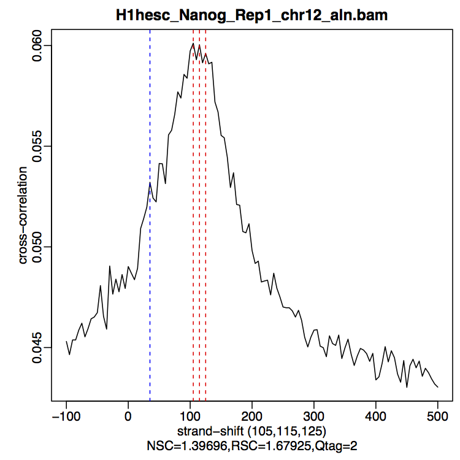
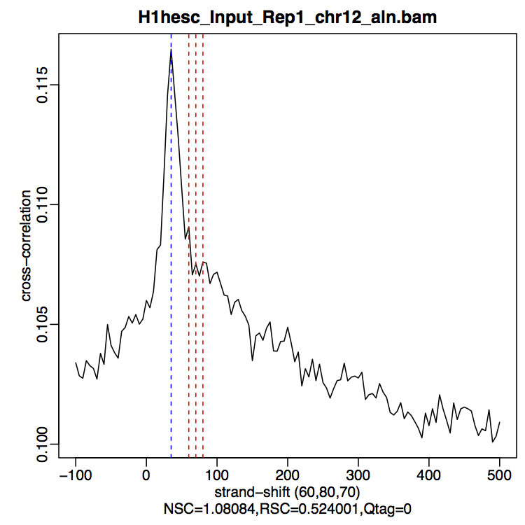

Approximate time: 1 hour

## Learning Objectives

* Discussing sources of low quality ChIP-seq data
* Understanding strand cross-correlation
* Using `phantompeakqualtools` to compute cross-correlation and associated QC
  metrics
* Evaluating the cross-correlation plot

## ChIP-Seq quality assessment

Prior to performing any downstream analyses with the results from a peak caller,
it is best practice to assess the quality of your ChIP-Seq data. What we are
looking for is good quality ChIP-seq enrichment over background.


## Strand cross-correlation

A very useful ChIP-seq quality metric that is independent of peak calling is
strand cross-correlation. It is based on the fact that a high-quality ChIP-seq
experiment will produce significant clustering of enriched DNA sequence tags at
locations bound by the protein of interest, that present as a bimodal enrichment
of reads on the forward and reverse strands.

The bimodal enrichment of reads is due to the following:

During the ChIP-seq experiment, the DNA is fragmented and the protein-bound
fragments are immunoprecipitated. This generates DNA fragments containing the
protein-bound region.

The + strand of DNA is sequenced from the 5' end, generating the red reads in
the figure below, and the - strand of DNA is sequenced from the 5' end,
generating the blue reads in the figure below.


*Nat Biotechnol. 2008 Dec; 26(12): 1351–1359*

Due to the sequencing of the 5' ends of the fragments, this results in an
enrichment of reads from the + strand (blue in the image below) being slightly
offset from the enrichment of reads from the - strand (red in the image below).
We need to **determine the number of bases to shift the peaks to yield maximum
correlation between the two peaks**, which **should** correspond to the
predominant **fragment length**. We can calculate the shift yielding the maximum
correlation using the **cross-correlation metric**.


### Cross-correlation metric

The cross-correlation metric is computed as the **Pearson's linear correlation
between the Crick strand and the Watson strand, after shifting Watson by k base
pairs.** Using a small genomic window as an example, let's walk through the
details of the cross-correlation below.

**At strand shift of zero, the Pearson correlation between the two vectors is 0.539.**


**At strand shift of 5bp, the Pearson correlation between the two vectors is 0.931**


**Keep shifting the vectors and for each strand shift compute a correlation value.**


In the end, we will have a table of values mapping each base pair shift to a
Pearson correlation value. This is computed for every peak for each chromosome
and values are multiplied by a scaling factor and then summed across all
chromosomes. We can then **plot cross-correlation values (y-axis) against the
shift value (x-axis)** to generate a cross-correlation plot.

The cross-correlation plot **typically produces two peaks**: a peak of
enrichment corresponding to the predominant **fragment length** (highest
correlation value) and a peak corresponding to the **read length** (“phantom”
peak).

High-quality ChIP-seq data sets tend to have a larger fragment-length peak
compared with the read-length peak. An example of a **strong signal** is shown
below using data from **CTCF (zinc-finger transcription factor)** in human
cells. With a good antibody, transcription factors will typically result in
45,000 - 60,000 peaks. The red vertical line shows the dominant peak at the true
peak shift, with a small bump at the blue vertical line representing the read
length.


An example of **weaker signal** is demonstrated below with a **Pol2** data.
Here, this particular antibody is not very efficient and these are broad
scattered peaks. We observe two peaks in the cross-correlation profile: one at
the true peak shift (~185-200 bp) and the other at read length. For weak signal
datasets, the **read-length peak will start to dominate**.


A failed experiment will resemble a cross-correlation plot using **input only**,
in which we observe little or no peak for fragment length. Note in the example
below the **strongest peak is the blue line (read length)** and there is
basically no other significant peak in the profile. The absence of a peak is
expected since there should be no significant clustering of fragments around
specific target sites (except potentially weak biases in open chromatin regions
depending on the protocol used). The read-length peak occurs due to unique
mappability properties of the mapped reads.


### Cross-correlation quality metrics

Using the cross-correlation plot we can **compute metrics for assessing
signal-to-noise ratios in a ChIP-seq experiment** and to ensure the fragment
length is accurate based on the experimental design. Poor signal-to-noise and
inaccurate fragment lengths can indicate problems with the ChIP-Seq data. These
metrics are described in more detail below:

#### Normalized strand cross-correlation coefficent (NSC):

The ratio of the maximal cross-correlation value divided by the background
cross-correlation (minimum cross-correlation value over all possible strand
shifts).

**Higher values indicate more enrichment, values less than 1.1 are
relatively low NSC scores, and the minimum possible value is 1 (no
enrichment).**

Datasets with NSC values much less than 1.05 tend to have low
signal to noise or few peaks (this could be biological, such as a factor that
truly binds only a few sites in a particular tissue type or it could be due to
poor quality).

#### Relative strand cross-correlation coefficient (RSC):

The ratio of the fragment-length cross-correlation value minus the background
cross-correlation value, divided by the phantom-peak cross-correlation value
minus the background cross-correlation value.

**The minimum possible value is 0 (no signal), highly enriched experiments have
values greater than 1, and values much less than 1 may indicate low quality.**

RSC values significantly low (< 0.8) tend to have low signal to noise and can be
due to failed and poor quality ChIP, low read sequence quality and hence lots of
mismappings, shallow sequencing depth or a combination of these. Like the NSC,
datasets with few binding sites (< 200) which are biologically justifiable also
show low RSC scores.

## `phantompeakqualtools`

The
[`phantompeakqualtools`](https://github.com/kundajelab/phantompeakqualtools)
package is a tool used to compute enrichment and quality measures for ChIP-Seq
data [[1](http://www.g3journal.org/content/4/2/209.full)]. We will be using the
package to compute the predominant insert-size (fragment length) based on strand
cross-correlation peak and data quality measures based on relative phantom peak.

### Set up

The `phantompeakqualtools` package is written as an R script, that uses
`samtools` as a dependency. The package has various options that need to be
specified when running from the command line. To get set up, we will need to
start an interactive session, load the necessary modules and set up the
directory structure:

```
$ srun -n 2 --mem 2000 -p classroom --pty bash

$ module load Phantompeaktools/1.2-IGB-gcc-4.9.4-R-3.4.1

$ cd ~/ngs_course/chipseq/results

$ mkdir chip_qc

$ cd chip_qc
```

We need to copy in some data (namely BAM index files) that we generated for you:

```
$ cd ~/ngs_course/chipsep/results/

$ cp /home/classroom/hpcbio/chip-seq/bowtie2/*.bam* ~/ngs_course/chipseq/results/bowtie2/
```

### Running `phantompeakqualtools`

To obtain quality measures based on cross-correlation plots, we will be running
the `run_spp.R` script from the command line which is a package built on
SPP. This modified SPP package allows for determination of the cross-correlation
peak and predominant fragment length in addition to peak calling. We will be
using this package solely for obtaining these quality measures (no peak
calling).

The options that we will be using include:

* `-c`: full path and name (or URL) of tagAlign/BAM file
* `-savp`: save cross-correlation plot
* `-out`: will create and/or append to a file several important characteristics
  of the dataset described in more detail below.

First, we need to find the location of the R script that we use to run this.
It's set as an executable but can't be run without using R, so we use a little
Linux knowledge to work around this:

```
$ which run_spp.R
/home/apps/software/Phantompeaktools/1.2-IGB-gcc-4.9.4-R-3.4.1/run_spp.R

$ ln -s /home/apps/software/Phantompeaktools/1.2-IGB-gcc-4.9.4-R-3.4.1/run_spp.R .
```

If you list the directory it should look like this:

```
$ ls -l
total 1
lrwxrwxrwx 1 instru03 instru03 72 Nov 16 12:26 run_spp.R -> /home/apps/software/Phantompeaktools/1.2-IGB-gcc-4.9.4-R-3.4.1/run_spp.R
```

This is a symbolic link, which is just a pointer to the original file. You can
alternatively use the full path to the script when you invoke it using
`Rscript`, but then I couldn't show you what a symbolic link was.

Now, if you wanted to compute metrics on a single file you normally do this:

```
## DO NOT RUN THIS
## THIS SCRIPT IS FOR COMPUTING METRICS ON A SINGLE FILE
$ Rscript run_spp.R -c=<tagAlign/BAMfile> -savp -out=<outFile>
```

You can also limit the strand shifts (x-axis in graph) by also using
`-s=<min>:<step>:<max>` (default is `-s=-500:5:1500`).
Since these should fairly narrow peaks, we will do that below.

>**NOTE:** Even though the script is called `run_spp.R`, we aren't actually
>performing peak calling with SPP.

From within the `phantompeakqualtools` directory, we will create output
directories and use a 'for loop' to **run the script on every BAM file**:

```
$ mkdir -p logs qual

$ for bam in ../bowtie2/*aln.bam
do
bam2=`basename $bam _aln.bam`
Rscript run_spp.R -s=-100:5:500 -c=$bam -savp -out=qual/${bam2}.qual > logs/${bam2}.Rout
done
```

The for loop generates **three output files**. The **quality metrics** are
written in a tab-delimited text file, and the **log files** contains the
standard output text. A third file is created in the same directory as the BAM
files. These are pdf files that contain the **cross-correlation** plot for each
sample. Let's move those files into the appropriate output directory:

```
$ mv ../bowtie2/*pdf qual

```

To visualize the quality metrics (.qual) files more easily, we will concatenate
the files together to create a single summary file that you can move over
locally and open up with Excel.

```
$ cat qual/*qual > qual/phantompeaks_summary.xls
```

Let's use Cyberduck and move the summary file over to our local machine for
viewing. Open up the file in Excel and take a look at our NSC and RSC values.

### `phantompeakqualtools`: quality metrics output

The qual files are tab-delimited with the columns containing the following information:

- COL1: Filename: tagAlign/BAM filename
- COL2: numReads: effective sequencing depth (i.e. total number of mapped reads in input file)
- COL3: estFragLen: comma separated strand cross-correlation peak(s) in decreasing order of correlation. (**NOTE:** The top 3 local maxima locations that are within 90% of the maximum cross-correlation value are output. In almost all cases, the top (first) value in the list represents the predominant fragment length.)
- COL4: corr_estFragLen: comma separated strand cross-correlation value(s) in decreasing order (col2 follows the same order)
- COL5: phantomPeak: Read length/phantom peak strand shift
- COL6: corr_phantomPeak: Correlation value at phantom peak
- COL7: argmin_corr: strand shift at which cross-correlation is lowest
- COL8: min_corr: minimum value of cross-correlation

The most important metrics we are interested in are the values in
columns 9 through 11 (these numbers are computed from values in the
other columns)

- **COL9**: Normalized strand cross-correlation coefficient (NSC) = COL4 / COL8
- **COL10**: Relative strand cross-correlation coefficient (RSC) = (COL4 - COL8) / (COL6 - COL8)
- **COL11**: QualityTag: Quality tag based on thresholded RSC (codes: -2:veryLow,-1:Low,0:Medium,1:High,2:veryHigh)


**How do the values compare to the thresholds mentioned above?** All samples
have quite high NSC values indicating more enrichment, a good signal to noise
and a fair number of peaks. Nanog-rep2 has a comparably higher NSC value which
might explain the increased number of peaks for that sample compared to the
others. The RSC and quality tags further indicate good chip signal and a quality
IP, yielding a very high quality tag. Based on these metrics, the samples look
good for further analysis.

### Cross-correlation plots

The cross-correlation plots show the best estimate for strand shift and the
cross-correlation values. This file can be viewed by transferring it to your
local machine using FileZilla. Copy `H1hesc_Nanog_Rep1_chr12_aln.pdf` to your
machine to view the strand shift. The cross correlation peak shows the highest
cross-correlation at fragment length 105, **How does this compare to the one we
generated using MACS?**.



Notice the difference with the input sample:



***
*This lesson has been developed by members of the teaching team at the [Harvard
Chan Bioinformatics Core (HBC)](http://bioinformatics.sph.harvard.edu/). These
are open access materials distributed under the terms of the [Creative Commons
Attribution license](https://creativecommons.org/licenses/by/4.0/) (CC BY 4.0),
which permits unrestricted use, distribution, and reproduction in any medium,
provided the original author and source are credited.*
